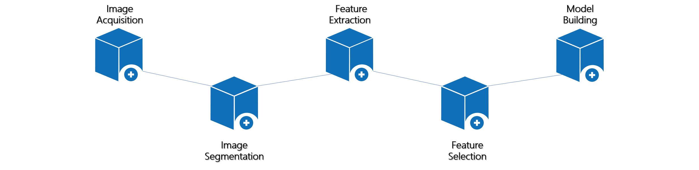

#  Open Radiomics

> 项目负责人：**`李志成博士`** **`李凌博士`**

在[open Radiomics Documentaion](https://ultimagetk.github.io/OpenRadiomics/)中你可以查看具体的介绍。

- 这是针对UltImageTK —— 医学影像处理软件的简单介绍。

- 你可以通过它来阅片，同时，我们还提供了大量的基础工具以及强大的影像组学模块。在本文档中，我们也会将当前环节处于影像组学流程中的位置给出示意。

- 我们不仅提供你使用这款软件([安装包下载链接](https://obs-huay-website.obs.cn-north-4.myhuaweicloud.com/download/UltimageTK_1.0_Installer_x64_win.exe))，还对这款软件的基础版本做了开源管理。这将对像你一样的医疗开发者的工作效率有非常大的提升。你可以在[UltimageTK](https://github.com/UltimageTK/OpenRadiomics)拉取源代码。

- 这款软件的适合人群是医疗工作者、教育和科研工作者。

