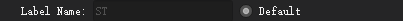

# Feature Extraction

<center>


</center>

There are several features used in radiomics: shape Based Features, first-order histogram based features, second-order histogram based or texture based features. Additionally, there are also some features obtained from specific images (such as Standardized Uptake Value (SUV) in PET). And also, some features only for multi-modal data sets, such as fractal features and feature fusion. For better user experience, UltImageTK provides a `visible` way to configure the feature extraction, instead of writing complex codes.

<center>


The Interface of Feature Extraction
</center>

## Perform a Feature Extraction
- Users can choose the features which need to be extracted on the left side of the interface by ticking the checkbox. All features are extracted by default (It could take a while if the amount of data is large).
- "Other" options in the column of the upper right side
    - Some preferences such as Interpolator, Resampled Pixel Spacing, weightingNorm are not available in this version.
    - `Label` The label's value of ROI. Attention: this value has to be included in the "Label" file; otherwise, it will cause an error in feature extraction.
    - `BinWidth` The default value is 25 in order to discretize the grayscale of the image while generating a histogram.

- The lower right side
    - `Label Name`: The file name of Label, and set to "ST" by default. You can customize it by unchecking the radioButton on the right, `do not include the suffix`.
    - `Ignore Files`: If you some files need to be excluded from the feature extraction, please fill in the file names here (`do not include the suffix`), and use a comma(,) between each file name.
    - `Data`: Image data sets that need to extract features.
        > The file structure of the data folder is as follows:
         ```
        Data folder
            └───Patient folder 1
                │   file011.nii  #Image file
                │   file012.nii  #Image file
                │   ST.nii  #Label file
            └───Patient folder 2
                │   file021.nii  #Image file
                │   file022.nii  #Image file
                │   ST.nii  #Label file
            └───Patient folder 3
                │   file031.nii  #Image file
                │   file032.nii  #Image file
                │   ST.nii  #Label file
                ...
        ```
    - `Output path`: The CSV file with data of extracted features will be stored in the path which you specified here, and you can use this file in further operations such as feature selection.