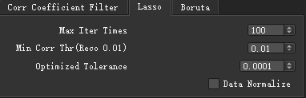
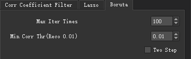

# Feature Selection

- The feature data are generated from the raw data by feature extraction, and each feature is an attribute of raw data. These features can be roughly divided into the following three types:
> 1. Related features: helpful for learning tasks (such as classification problems) and can improve the effectiveness of learning algorithms.
> 2. Irrelevant features: It is not helpful for learning tasks and will not bring any improvement to the effect of the algorithm.
> 3. Redundant features: will not bring new information to the learning tasks, or the information of this feature can be inferred from other features.

- Feature selection is the process of selecting relevant feature subsets from a given feature set. Feature selection is for:
> 1. Dealing with data dimension disaster (dimensionality reduction)
> 2. Reduce the difficulty of learning tasks
> 3. Improve the model's efficiency

- UltImageTK provides three commonly used feature selection algorithms in the feature selection module: `Correlation coefficient filter`, `Lasso`, and `Boruta`

Perform a Feature Selection

## Configuration
- The data input column is in the upper part
> **Feature file**: Specify the file path for feature selection (generally the output file of feature extraction or other feature files referring to the specific format)
> **Classification label**: A label file corresponds to the feature file (the default index of the patient label is "ID," and the default index of the classification label is "label"), the content of the file is as follows:

|**`ID`**       |   **`label`**        | 
|:-:            |   :-:          |
|patient1       |   1        | 
|patient2       |   0      |
|patient3       |   1      |
|patient4       |   1      |
|patient5       |   0      |

- The algorithm of the feature selection algorithm column is in the middle part part
### Correlation coefficient filter

Correlation coefficient filter

- Maximum value: The maximum value of the correlation coefficient between pairs of features in this feature file
- Minimum value: The minimum value of the correlation coefficient between pairs of features in this feature file
- Coefficient threshold: The threshold value is between the maximum and the minimum value. This threshold is used for feature selection. Features smaller than the coefficient threshold will be retained.

### Lasso

Lasso

- Maximum number of iterations: The maximum number of algorithm iterations, default 100 times
- Correlation minimum threshold: A constant multiplied by L1, default 0.01
- Optimized tolerance: Stop the calculation when the error between two iterations is less than this tolerance, the default is 0.0001
- Data standardization: Choose whether the data needs to be normalized

### Boruta

Boruta

    - Maximum number of iterations: The maximum number of algorithm iterations, default 100 times
    - Correlation minimum threshold: If the calculated P value of a feature is smaller than this threshold, then this is a relevant feature, the default of threshold is 0.01
    - Two-step correction: Bonferroni correction is provided, check to enable

- The data output column is in the lower part part
> **Output path**: After the feature selection algorithm, the output file will be saved in this path
