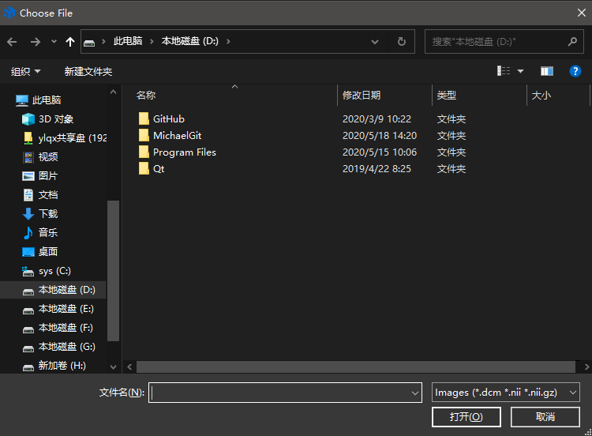
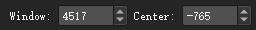
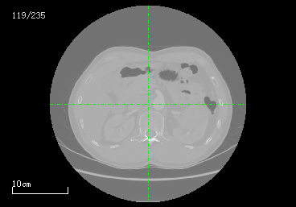

# Image Reading
<center>


</center>

- Image reading is an essential function of this software. It supports standard medical image formats such as Dicom, Nifti, and so on. By reading the image, users can easily use the functions such as scrolling, moving, zooming, and adjusting the Window Width, Window Level. This also a part of the image acquisition process.

## Multi-format Support
  

- The Image Reading function support three types of medical image, *.dcm, *.nii, and *.nii.gz in current version (1.0.1), and more formats will be supported in later versions. Compared with other similar softwares, you can customize the path containing Chinese, this is friendly to Chinese users.

## How to Read
- Scroll up and down with the mouse wheel to browse the image in an image sequence.
- Press Ctrl and scroll the mouse wheel to zoom in or zoom out the image.
- Press Ctrl and drag the image with the mouse left-click button to adjust the viewpoint of an image. This function is convenient to view the area of interest in an image.
> Read an image in UltimageTK is almost based on the user's browsing habits in Windows. Users can adapt to the way of using the mouse and keyboard in a short time.

## Window Width and Window Level
- To observe different body parts clearly, you can adjust the value of grayscale by setting the values of window width and window level.
- The values of window width and window level can be adjusted here. 

> - Window Width: The range of CT numbers included in the gray scale
> - Window Level (the midpoint of a window): the CT number setting in Hounsfield units of the midpoint of the window width, which is the gray scale of the image. 

```
Window Width (WW) and Window Level (WL) are often used in conversions of radiological images like CT. For example, WW: 400, WL: 60, what does it means?
The color bit depth of a normal monitor is 8 bit or 8 bit per channel in (RGB). However, the bit depth of medical images is 10-12 bit (normally stored in the 16-bit variable, such as short or unsigned short). Therefore, mapping from 10-12 bit to 8 bit is necessary for display, even if WW and WL conversion are not performed (if the image is grayscale, just simply set all RGB channels with the same grayscale value).
For example, Bone windows and lung windows in radiography are designed to mapping an image to 8 bit with certain WW and WL values for display on the monitor. 
e.g. WW:400, WL:60:
Mapping an image to 8 bit with WL=60 and WW=400 for display. The range of grayscale has been mapping from (-140 ~ 260) to (0 ~ 255), while the whole grayscale range of original image could be as huge as (-1024 ~ 4096).

    Min = WindowCenter — windowWidth/ 2
    Max = WindowCenter + windowWidth/ 2
```

> The CT Values of Human Tissue（HU）
<center>

|**`Tissue`**       |   **`CT Value`**        |     **`Tissue`**     |   **`CT Value`** |
|:-:          |   :-:          |   :-:           |  :-:   |
|Bone     |   >400        |    Liver       |     50～70|
|Calcification       |   80~300      |    Spleen       |    35～60|
|Blood Clot       |   64~84       |    Pancreas       |   30～55|
|White matter     |   25~34       |    Kidney       |   25～50|
|Gray matter     |   28~44       |    Muscle       |   40～55|
|Cerebrospinal fluid     |   3~8         |    Gallbladder       |   10～30|
|Blood       |   13~32       |    Thyroid     |  50～90|
|Plasma       |   3~14        |    Fat       |  －20～－100|
|Exudates     |   >15         |    Water         |       0|

</center>

## Example Description
<center>



</center>

> - The position of this image in the whole sequence is shown in the upper left corner.
> - The scale of this image is shown in the bottom left corner.

Left click on the image to see the physical value of this current position. 
> The CT value of a substance is equal to the difference between the attenuation coefficient of this substance and the attenuation coefficient of water. Then the ratio to the attenuation coefficient of water is multiplied by 1000. That is, the CT value of a substance=1000×(u-u<sub>water</sub>)/u<sub>water</sub>.The Unit of CT value is **`HU`** (Hounsfield Unit). The CT value is not an absolute value but a relative value. The CT values of different tissues are different, and each fluctuates within a specific range.


## View Mode
There are three view modes in the interface by default, and the single view mode (exclusive mode) can be turned on by clicking the button  under each view.

> - Coronal Plane: A vertical anatomical plane that divides the standing body into front and rear halves.
> - Sagittal Plane: The front-to-back longitudinal vertical plane that divides the upright body into right and left halves.
> - Transverse Plane: A plane parallel to the ground that divides the standing body into upper and lower portions.