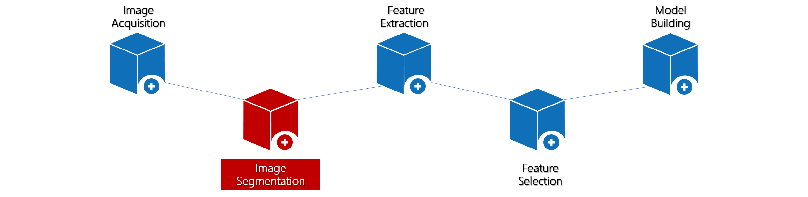

# 图像分割

- 图像分割是指对感兴趣区部位的分割，也就是在影像图像上勾画出感兴趣区域，从而针对这一特定区域计算出影像组学特征。由于图像分割是影像组学特征提取、特征选择和建立模型的前提条件，因此其重要性是不言而喻的。UltImageTK也在这部分为用户准备了非常丰富和细致的操作体验。

## 标签值配置
- 用户可根据实际情况，在此处自定义分割画笔的颜色和名称。

## 图像分割
- 当前版本中，为用户提供了 **`多边形`** 和 **`画笔`** 两种分割目标区域的方式(`*在以后的版本中，我们将会添加更多的标注方式，以便用户能有更灵活的选择`)。

> - 多边形标注：用户可以逐个点标注相对规则的感兴趣区域(ROI)
> - 画笔标注：对于不规则区域，用户可以使用画笔，移动鼠标进行连续曲线绘制，描绘出感兴趣区域

- 绘制完成后，用户可以通过调节已标注区域的透明度来方便的观察已标注区域和其原始数据之间的差异，对于调整标注区域是非常有帮助的。

- 修改已标注好的ROI
   > * 对于多边形和画笔标注好的ROI，你可以直接用鼠标左键，选中这个图形目标，就可以拖动它的位置
   > * 如果需要调节已绘制的目标形状，可以通过鼠标左键选中并调节需要改变位置的点，以此来调整已绘制好的ROI形状

- 查看ROI参数
   > * 绘制好ROI后，你可以用鼠标左键选中它，此时在当前视图的左上角，会出现这个形状的相关信息，描述了这个区域的宽、高以及面积。这些参数可以给使用者一些提示，方便的了解到该ROI的几何信息。

## 分割结果保存
- 标注完成后你需要点击左侧的保存按钮，以保存已经绘制的结果，这份结果将会被保存在你的目录下，以"*.lsr"的文件格式存储，这是我们自己开发的文件格式，你可以在[LRS数据结构介绍](zh-cn/analysisApi)中查看其结构。
- 保存完成后，你将可以在下次打开这个文件（位置未变动）时仍然能看到标注结果。
- 如果在保存完成后，你想将标注的结果导出，UltImageTK提供了3种导出类型，分别是Dicom、Nifit以及LSR格式，你可以任意选择将其导出到自定义的位置。