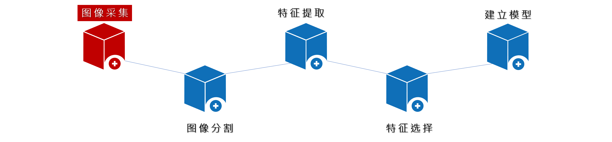
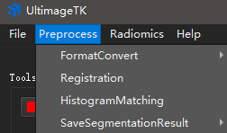
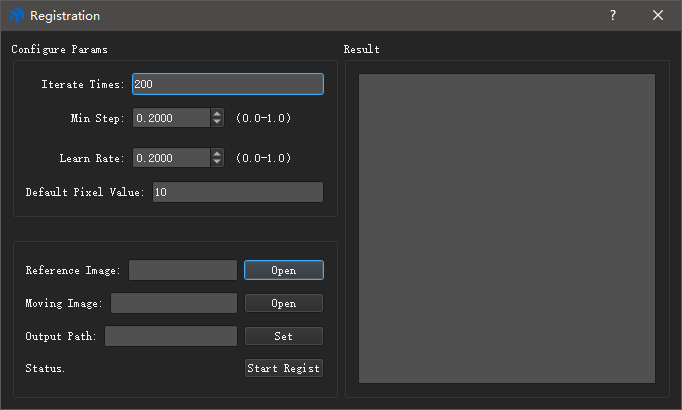
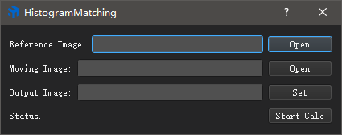

# Image Preprocessing Tools

Several useful preprocessing tools are provided in UltImageTK, such as format conversion, image registration, and histogram matching, etc. These can be considered as a part of the image acquisition module, which prepared the images for other modules such as image splitting and radiomics. The preprocessing procedure is often known as "cleaning" in the field of data labeling. "Dirty data" means some data can not be used directly because there are not meet specifications. The procedure of making "dirty data" work called "data cleaning."

## Format Conversion
- UltimageTK provides a variety of format outputs to help users overcome the inconvenience when operating medical data.
    - `Dicom to Nifti`
    - Dicom to Nrrd
    - Nifti to and from Nrrd

    It is easy to convert image format in UltimageTK, just simply choose your preferred format in the drop-down menu:
    

    
    
    

## Image Registration

- Deviations (the targets not in the same place on each image) may occur in the images acquired by different equipment, even by the same equipment, but acquired at different periods. Users could fix the deviation as much as possible by using the function "Image Registration."
- Click "Image Registration" in the "Preprocessing" menu. After setting each appropriate parameters, and choosing the `Reference Image`, `Matching Image`, `Output Path`, click "Calculate." The results will show on the right side, such as error, matching matrix, etc. If something goes wrong during the registration process, an alert will also occur on the right side. 

>   - *`Matching Image` is the image which needs to be adjusted*

## Histogram Matching
- When using equipment to acquire the images of patients, some deviations may occur due to the setting of parameters. Users can rectify the color distribution of an image by providing a reference image with the "Histogram Matching" function.
- Click "Histogram Matching" in the "Preprocessing" menu. After setting appropriate `Reference Image`, `Matching Image`, `Output Path`, click "Calculate." The processed image, which matches the reference image in color distribution, will be generated and saved in the output path.

