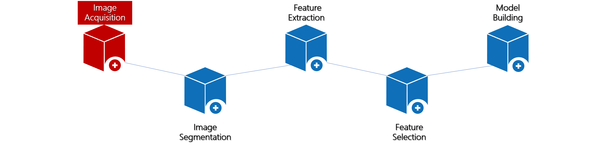

# 预处理工具

UltImageTK提供了很多常用的工具，包括多种格式转换、配准、直方图匹配等。为图像分割和影像组学的其他部分打好基础，此模块也可算作图像采集的部分。在数据标注领域，通常称之为“清洗”，我们将不规范的数据或者不能直接使用的数据成为“脏数据”，脏数据到可直接用于使用的数据的处理过程，就称之为“清洗数据”。

## 格式转换
- UltimageTK提供多样的格式转换以解决用户在使用医学数据过程中在格式上遇到的诸多不便
    - `Dicom格式图片转换为Nifti格式图片`
    - Dicom格式图片转换为Nrrd格式图片
    - Nifti格式图片和Nrrd格式图片互相转换

    UltimageTK中的格式转换操作流程非常简单，只要在
    

    
    
    

    中选择某种需要转换的方式即可。

## 配准

- 不同设备或同一设备不同时期采集的影像，很可能出现同一造影位置在影像上位置的偏差，用户可通过配准的方式让其造影部分在图像中的像素位置趋于一致。
- 在预处理菜单中找到配准选项，设置好`参考图像`、`匹配图像`、`输出路径`，点击开始计算，即可得到与参考图像色彩分布趋于一致的图像。

>   - *`匹配图像`即为将要调整的影像*

## 直方图匹配
- 由于设备采集病患影像时可能出现一些参数偏差，用户可以提供参考图像来矫正当前需要浏览的影像的色彩分布。直方图匹配功能提供了这种实现方式。
- 用户可以在预处理菜单中找到直方图匹配功能