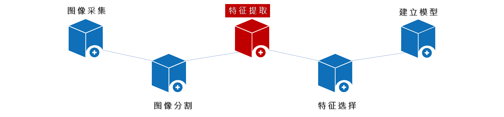
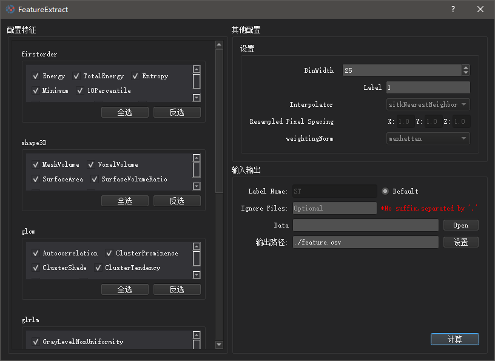
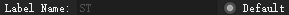

# 特征提取

<center>



</center>

影像组学特征可以分为：形状特征，一阶直方图特征，二阶直方图或纹理特征。还有一些获取于特定图像的影像组学特征（如PET中的SUV度量），以及仅适用于多模式数据集的分形和融合特征。这里提供`可视化`的特征提取配置，无需编写复杂的代码，优化操作体验。

<center>



特征提取界面
</center>

## 配置介绍
- 左侧为需要提取的特征，用户可以勾选感兴趣的特征进行提取，默认状态下为全部提取（数据量大时可能耗时较长）。
- 右上侧其他配置栏中
    - Interpolator, Resampled Pixel Spacing, weightingNorm参数选择当前版本不开放
    - `Label` 标签图中感兴趣区域（ROI）的标签值，该值必须在Label文件中存在，否则将导致特征提取失败
    - `BinWidth` 进行直方图绘制时，为了使图像灰度离散化，默认值25

- 右下侧
    - `Label Name`: 标签文件名，默认名为 ST ，你可以取消右侧的radioButton，以设置自定义的Label文件名，`不需要输入文件后缀名`
    - `Ignore Files`: 如果有文件不需要提取特征，可以在这里填写相应的文件名（`不需要输入文件后缀名`），多个文件名的情况下，需要用英文标点逗号","隔开
    - `Data`：需要提取特征的图像文件集
        > 文件夹下面的文件结构示意如下
         ```
        Data文件夹
            └───病人文件夹1
                │   file011.nii  #图像文件
                │   file012.nii  #图像文件
                │   ST.nii  #标签文件
            └───病人文件夹2
                │   file021.nii  #图像文件
                │   file022.nii  #图像文件
                │   ST.nii  #标签文件
            └───病人文件夹3
                │   file031.nii  #图像文件
                │   file032.nii  #图像文件
                │   ST.nii  #标签文件
                ...
        ```
    - `输出路径`:这里会输出提取好特征的csv文件，存储到你指定的路径下，以用于后续特征选择等操作。