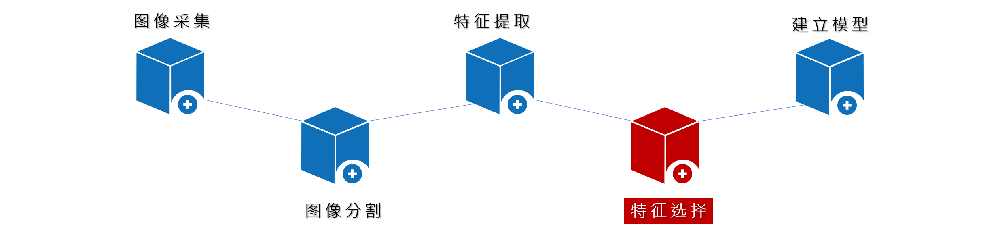
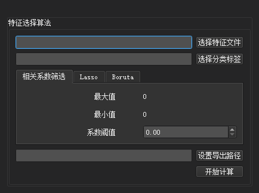
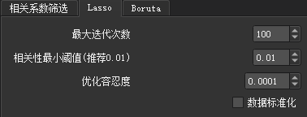
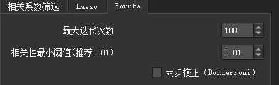

# 特征选择

- 原始数据经过特征提取后得到特征文件，每一个特征都代表了原始数据的一个属性。而这些特征可以大致分为以下三类：
> 1. 相关特征：对于学习任务（例如分类问题）有帮助，可以提升学习算法的效果
> 2. 无关特征：对于学习任务没有任何帮助，不会给算法的效果带来任何提升
> 3. 冗余特征：不会给我们的学习任务带来新的信息，或者这种特征的信息可以由其他的特征推断出

- 特征选择就是从给定的特征集合中选择出相关特征子集的过程。进行特征选择的目的：
> 1. 处理数据维数灾难（降维）
> 2. 降低学习任务的难度
> 3. 提升模型的效率

- 软件提供的特征选择模块包含了常用的三种特征选择算法：`相关系数筛选`、`Lasso`和`Boruta`

特征选择界面

## 配置介绍
- 上侧侧为数据输入部分
> **特征文件**：指定需要进行特征选择的文件路径（一般为特征提取的输出文件或参考其格式的其他特征文件）
> **分类标签**：对应上面特征文件的标签文件（病人标签默认索引为‘ID’，分类标签默认索引为‘label’），文件内容参考如下图：

|**`ID`**       |   **`label`**        | 
|:-:            |   :-:          |
|patient1       |   1        | 
|patient2       |   0      |
|patient3       |   1      |
|patient4       |   1      |
|patient5       |   0      |

- 中间为特征选择算法部分
### 相关系数筛选

相关系数筛选

- 最大值：当前导入的特征文件中两两特征之间相关系数的最大值
- 最小值：当前导入的特征文件中两两特征之间相关系数的最小值
- 系数阈值：用户根据最大最小值来设置在这个区间的系数阈值进行特征选择，筛选出小于系数阈值的特征

### Lasso

Lasso

- 最大迭代次数：算法迭代的最大次数，默认100次
- 相关性最小阈值：与L1项相乘的常数，默认0.01
- 优化容忍度：两次迭代间误差小于容忍度时停止计算，默认0.0001
- 数据标准化：选择数据是否归一化处理

### Boruta

Boruta

    - 最大迭代次数：算法迭代的最大次数，默认100次
    - 相关性最小阈值：如果计算得到的某特征P值比设定阈值小，则判定为相关特征，默认0.01
    - 两步校正：提供了Bonferroni校正，勾选为启用

- 下侧为数据输出部分
> **导出路径**：设置经过特征选择算法输出文件的保存路径
