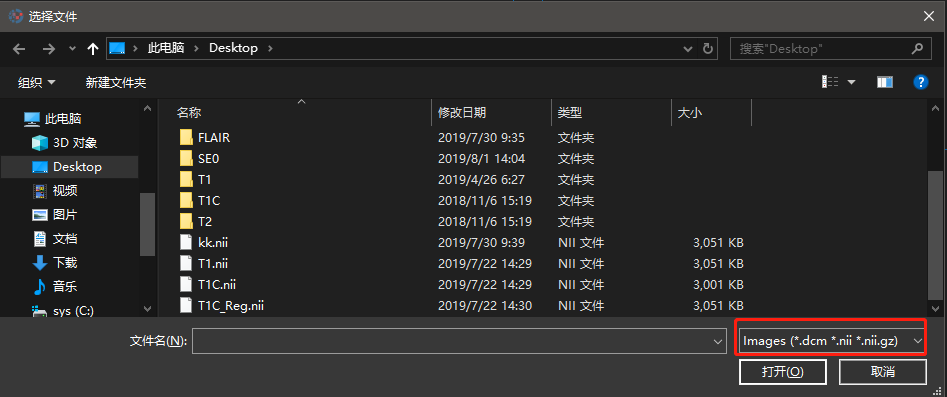

# 阅片
<center>


</center>

- 阅片功能是本软件的基础功能，包括对Dicom格式、Nifti格式图片的滚动浏览、移动、缩放、调节窗位、窗宽值显示等子功能。该部分功能，属于广义的图像采集过程。

## 支持打开多种格式
  

- 目前版本（1.0.1），我们提供*.dcm、*.nii、*.nii.gz三种格式医学图像的打开，后期的版本中我们将支持更多格式的医学图像。相对于其他的一些软件，UltiamgeTK可以打开中文路径，为中文用户提供便捷。

## 浏览方式
- 使用鼠标滚轮可以上下翻看图片序列中的影像
- 按住ctrl键滚动鼠标，可以对图像进行缩放查看
- 按住ctrl键和鼠标左键可以拖动图片，对当前查看的图片进行位置调整，对于放大后的图片，该功能可以方便查看图片局部信息
> UltimageTK的阅片方式完全参考Windows下的用户浏览图片习惯，鼠标和键盘的按键习惯也一贯沿用，不需要用户长时间的适应。

## 窗位窗宽
- 设置窗位、窗宽值可以依据图像的物理值对图像显示的灰度值进行调整，为观测到不同身体部位下的不同成分提供便利
- 在处可以对图像的窗位窗宽进行调节

> - 窗宽： 指CT图像所显示的CT 值范围
> - 窗位（窗中心）： 指窗宽范围内均值或中心值

```
CT等放射医学影像常有窗宽（Window Width,简写WW）窗位（Window Level,简写WL）的转换，比如窗宽400，窗位60，这代表什么意思呢？
常规显示器的颜色位深是8bit，哪怕是彩色显示器，也是RGB每通道是8bit。而医学图像通常是10~12bit（通常用16bit的变量类型表示，比如 short 和 unsigned short ），因此即使不做窗宽窗位转换也需要将10~12bit的数据映射到8bit来显示（显示器是彩色，则灰度图像的话每通道颜色一样即可）
医学图像中常有个骨窗、肺窗等的概念，即将具体的某个窗宽窗位的值来映射到8bit显示。 
WW:400,WL:60举例：
它表示将窗位是60，窗宽是400的像素映射到8bit来显示，即将像素范围是 -140 ~ 260 的像素映射到 0 ~ 255,毕竟原始像素范围可能是-1024~4096 这样的范围。

    Min = WindowCenter — windowWidth/ 2
    Max = WindowCenter + windowWidth/ 2
```

> 常见人体组织的CT值（HU）
<center>

|**`组织`**       |   **`CT值`**        |     **`组织`**     |   **`CT值`** |
|:-:          |   :-:          |   :-:           |  :-:   |
|骨组织     |   >400        |    肝脏       |     50～70|
|钙值       |   80~300      |    脾脏       |    35～60|
|血块       |   64~84       |    胰腺       |   30～55|
|脑白质     |   25~34       |    肾脏       |   25～50|
|脑灰质     |   28~44       |    肌肉       |   40～55|
|脑脊液     |   3~8         |    胆囊       |   10～30|
|血液       |   13~32       |    甲状腺     |  50～90|
|血浆       |   3~14        |    脂肪       |  －20～－100|
|渗出液     |   >15         |    水         |       0|

</center>

## 示例含义说明
<center>


</center>

> - 左上角显示当前图像在序列中的位置
> - 左下角为图像的比例尺

用户鼠标点下后可以查看当前位置的物理值（这里的value）
> 某物质的CT值等于该物质的衰减系数与水的衰减系数之差，再与水的衰减系数之比后乘以1000。即某物质CT值=1000×（u—u水）/ u水，其单位名称为 **`HU`**（Hounsfield Unit），可见CT值不是一个绝对值,而是一个相对值.不同组织的CT值各异,各自在一定范围内波动


## 窗口浏览方式
用户可以使用默认的三个视图方式进行浏览，也可以点击每一个视图下的按钮开启单视图（独占模式）浏览方式。

> - 冠状面（英文名： Coronal Plane）：是沿左，右方向将人体纵切为前后两部分的断面
> - 矢状面（英文名： Sagittal Plane）：沿身体前后径所作的与地面垂直的切面，其中通过正中线的切面称正中面
> - 横断面（英文名： Transverse Plane）：横断身体，与地面平行之切面，亦称水平面